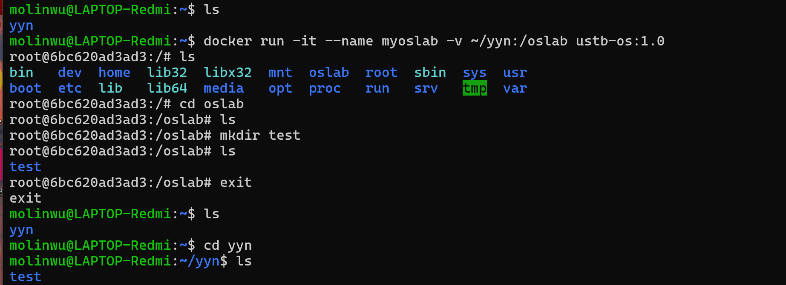

import { Tabs, TabItem } from '@astrojs/starlight/components';

## 基础开发环境

工欲善其事, 必先利其器. 在开始操作系统之前, 你应该先完成相关环境的配置, 这是十分重要的.

为了减轻同学们配环境的负担, 我们决定使用 Docker 环境。Docker 是一个开源的容器化平台, 可以帮助开发者将应用程序及其依赖项打包到一个独立的容器中, 并在任何环境中运行。

:::note
我们建议使用 vscode + docker 进行实验。

如果你已经拥有这两个工具, 则可以跳过这一步，直接获取实验环境和代码进行实验。
:::

首先，我们建议你下载轻量级代码编辑器 vscode, 并安装 docker 插件。
- [vscode 下载与安装](../vscode/)


其次，我们需要你的操作系统支持 Docker ，如果你之前没有安装过 Docker ，请先参考 [**Docker 环境配置**](../docker/) 章节进行 Docker 的配置。 如果你之前有使用过 Docker ，则可以跳过这一步。

:::tip 
验证你的操作系统支持 Docker: 
#### windows
按 win + R 打开运行窗口，输入 `cmd` 打开命令行窗口。
```shell
C:\Users\noonering>docker --version
Docker version 28.1.1, build 4eba377
```
#### linux
打开终端, 输入以下命令验证 Docker 是否安装成功:
```shell
$ docker --version
Docker version 28.1.1, build 4eba377
```
#### macos
打开终端, 输入以下命令验证 Docker 是否安装成功:
```shell
$ docker --version
Docker version 28.1.1, build 4eba377
```
如果输出了 Docker 的版本信息, 则说明你的操作系统支持 Docker 。
> 注意：我们建议你安装和教程相同的版本的 Docker 或 更高的版本，因为我们还没有测试过旧版本是否兼容。
:::

完成上述配置之后就可以开始实验了。

## 加载实验环境和代码

我们会提供一个包含所有实验环境的 Docker 镜像的tar包，将其下载到本地，**并记住这个地址(绝对地址)**
<Tabs>
  <TabItem label="Windows">
    ```bash 
    # 加载docker环境
    # 将其中的C:\docker-image-os\ustb-os.tar替换为你下载的地址
    # 例如 "C:\Users\yourname\ustb-os-lab\ustb-os.tar"
    docker load -i C:\docker-image-os\ustb-os.tar

    # 查看加载的镜像
    docker images

    # 运行容器，挂载本地目录到容器中的/oslab目录
    # 这样你对容器中/oslab目录的修改会反映在你的目录中
    # 其中${HOME}\yyn是你本地的目录，你可以将其替换为你自己的目录
    # /oslab是容器中的目录，你也可以自己进行设置
    docker run -it --name myoslab -v ${HOME}\yyn:/oslab ustb-os:1.0
    ```
  </TabItem>
   <TabItem label="Linux">
   ```bash
    # 加载docker环境
    # 将其中的/mnt/c/docker-image-os/ustb-os.tar替换为你下载的地址
    # 例如/home/yourname/ustb-os-lab/ustb-os.tar   
    docker load -i /mnt/c/docker-image-os/ustb-os.tar

    # 查看加载的镜像
    docker images

    # 运行容器，挂载本地目录到容器中的/oslab目录
    # 这样你对容器中/oslab目录的修改会反映在你的目录中
    # 其中~/yyn是你本地的目录，你可以将其替换为你自己的目录
    # /oslab是容器中的目录，你也可以自己进行设置
    docker run -it --name myoslab -v ~/yyn:/oslab ustb-os:1.0
    ```

  </TabItem>
  <TabItem label="MacOS">
    ```bash 
    # 洸汐或者晶晶试一下
    docker load -i C:\docker-image-os\ustb-os.tar
    docker run -it --name myoslab -v ${HOME}\yyn:/oslab ustb-os:1.0
    ```
  </TabItem>
</Tabs>

如下图所示，容器中的/oslab目录被挂载到了本地的~/yyn目录中。
在容器中的/oslab中创建了test文件夹，在退出之后，你可以在本地的~/yyn目录中看到test文件夹。



如此你就可以将代码保存到本地，然后使用docker的环境进行开发。


